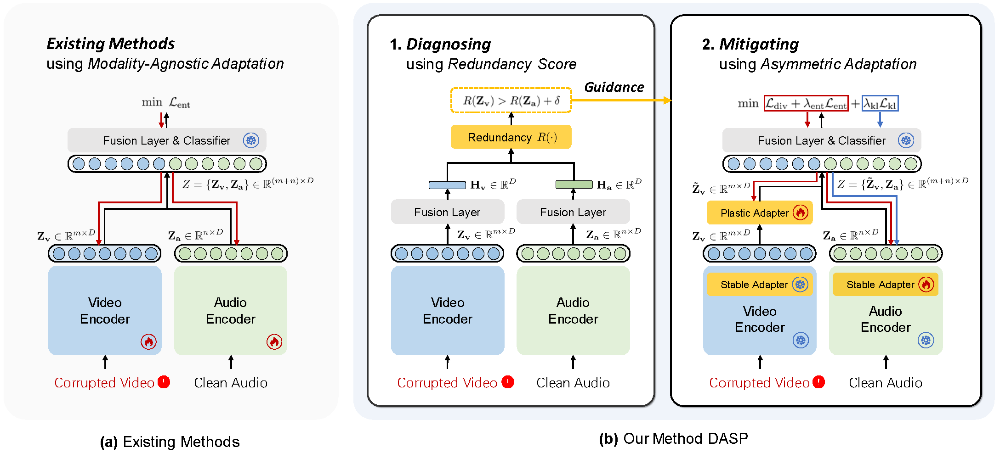

# <div align="center">✨Decoupling Stability and Plasticity for Multi-Modal Test-Time Adaptation</div>

<div align="center">
<a href="https://arxiv.org/abs/2603.00574" target="_blank">
    
</a>
</div>

</p>

<div align="center">
<p align="center">
  
</p>
</div>

## 📢 News
- **[2026-3-05]** 🔍 Codebase released!
- **[2026-3-03]** 📄 Paper available on [arXiv](https://arxiv.org/abs/2603.00574).
- **[2026-2-21]** 🎉 **DASP** has been accepted at **CVPR 2026**!

## 🚀 Quick Start

### 1. Installation
``` bash
conda create -n dasp python=3.10 -y
conda activate dasp
pip install -r requirements.txt
```

### 2. Preparation
We evaluate Multi-Modal Test-Time Adaptation on the **VGGSound-C** and **Kinetics50-C** benchmarks, following the [READ (ICLR 2024)](https://github.com/XLearning-SCU/2024-ICLR-READ) protocol.

#### 📂 External Resources

| **Item**                  | **Source**                                                                                               |
| ------------------------- | -------------------------------------------------------------------------------------------------------- |
| **Benchmark Datasets**    | [Google Drive](https://drive.google.com/drive/folders/1SWkNwTqI08xbNJgz-YU2TwWHPn5Q4z5b?usp=sharing) / [Baidu Cloud](https://pan.baidu.com/s/1Xo3IxQyd_fkzMVofDWKYVw?pwd=fnha)    |
| **Kinetics50 Checkpoint**   | [cav-mae-ft-vgg.pth](https://drive.google.com/file/d/1m38uCAfwL--RP6rWtOvGee4i2SfAzbjl/view?usp=sharing) |
| **VGGSound Checkpoint** | [cav-mae-ft-ks50.pth](https://www.dropbox.com/s/dl/f4wrbxv2unewss9/vgg_65.5.pth)                         |


#### 🏗️ Directory Structure
Please ensure your workspace is organized as follows:
```
├── ckpt/
│   ├── cav-mae-ft-ks50.pth     # Renamed from cav_mae_ks50.pth
│   └── cav-mae-ft-vgg.pth      # Renamed from vgg_65.5.pth
├── data/
│   ├── Kinetics50/             # Extracted from Kinetics50.zip
│   │   ├── audio_val256_k=50/
│   │   └── image_mulframe_val256_k=50/
│   └── VGGSound/               # Extracted from Kinetics50.zip
│       ├── audio_test/
│       └── image_mulframe_test/
└── preprocess/
    ├── frost_images/
    └── weather_audios/         # Extracted from Kinetics50.zip
```

#### 🛠️ Data Preprocessing
To evaluate robustness, you must generate synthetic corruptions for video or audio modalities.

**Video Corruptions**
``` bash
python ./preprocess/make_corruptions_image.py \
    --corruption 'all' \
    --severity [5/4/3/2/1] \
    --data_path 'data/Kinetics50/image_mulframe_val256_k=50' \
    --save_path 'data/Kinetics50/image_mulframe_val256_k=50-C'
```
**Audio Corruptions**
``` bash
python ./preprocess/make_corruptions_audio.py \
    --corruption 'all' \
    --severity [5/4/3/2/1] \
    --data_path 'data/Kinetics50/audio_val256_k=50' \
    --save_path 'data/Kinetics50/audio_val256_k=50-C' \
    --weather_path 'preprocess/weather_audios'
```

### 3. Evaluation
Run the following command using the provided configuration files. You can choose between `reset_each_shift` or `continual` adaptation settings.
``` bash
python test_time.py \
    --cfg cfgs/[ks50_c/vggsound_c]/[dasp/read/abpem/tsa/pta].yaml \
    SETTING [reset_each_shift/continual]
```

#### ⚙️ Customizing Domain Sequences
You can easily configure the sequence of domain shifts (corruptions) by modifying the `DOMAIN_SEQUENCE` list within the respective configuration YAML files. We provide three standard scenarios (interleaved, video-only, audio-only) that you can uncomment as needed:

``` yaml
CORRUPTION:
  DATASET: ks50
  NUM_EX: -1
  SEVERITY:
    - 5
  DOMAIN_SEQUENCE:
    # S1: interleaved modality corruptions
    - {'video': 'gaussian_noise'}
    - {'video': 'shot_noise'}
    - {'audio': 'gaussian_noise'}
    # ...

    # S2: video corruptions only
    # - {'video': 'gaussian_noise'}
    # - {'video': 'shot_noise'}
    # ...

    # S3: audio corruptions only
    # - {'audio': 'gaussian_noise'}
    # - {'audio': 'traffic'}
    # ...
```

## 🙏 Acknowledge
This work is implemented based on [test-time-adaptation](https://github.com/mariodoebler/test-time-adaptation). We greatly appreciate their valuable contributions to the community.

## 📚 Citation
If you find our work useful for your research, please cite:
``` bibtex
@article{he2026decoupling,
    title={Decoupling Stability and Plasticity for Multi-Modal Test-Time Adaptation}, 
    author={Yongbo He and Zirun Guo and Tao Jin},
    journal={arXiv preprint arXiv:2603.00574},
    year={2026}
}
```